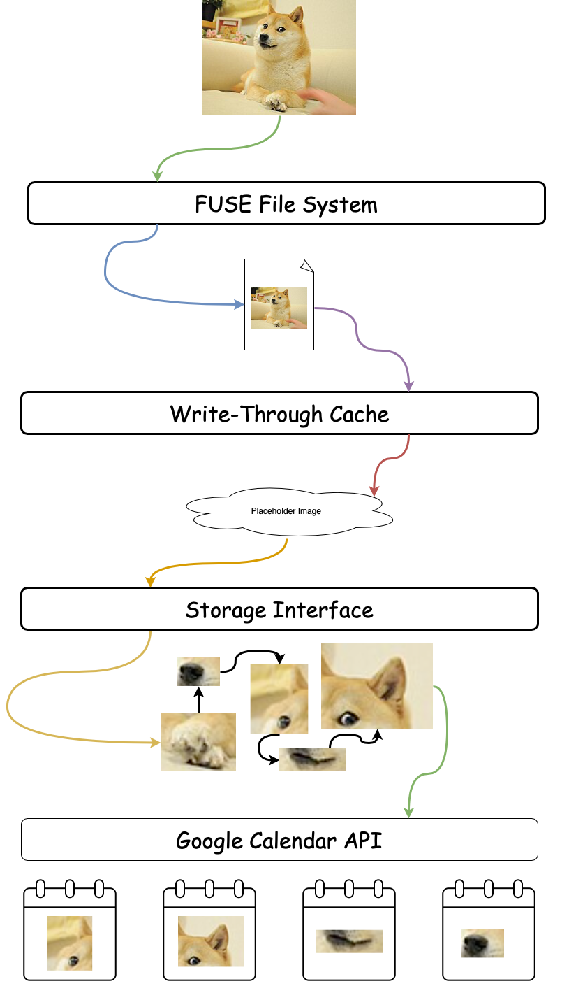

WhenFS turns your Google Calendar into a FUSE filesystem. It whimsically supports the following features:

- Create a filesystem out of existing Google Calendars, or create a new one from scratch
- Read and write files, directories and... well, just files and directories
- Mount your friends' WhenFS calendar file systems to share files in the silliest way possible

This is what the Mona Lisa looks like when uploaded to Google Calendar:

   
   .jpg

  ⬇️

The image above contains all the image's data split up across hundreds of tiny calendar event descriptions.
The entire filesystem—files, directories, reads, writes and more—is all based on manipulating these Google Calendar events.

WhenFS is an example of a [harder drive](http://tom7.org/harder/)—a hard drive we didn't want or need.

## How Does it Work?

WhenFS operations start at the FUSE file system layer, facilitated by [fuser](https://github.com/cberner/fuser). The filesystem sits on top of a write-through object cache, which itself sits on top of an abstract data storage interface with swappable calendar API backends.

If you poke around enough, you'll likely run into bugs, edge cases, and completely unimplemented features. There are no plans to fix these.

## Why Did You Do This?

I used this project as an opportunity to learn about Rust and FUSE file systems. I also think it's hilarious.

Visitors interested in the code should note that this is an irredeemably messy codebase—it's full of hacks, unidiomatic code, and wildly poor design decisions.

However, visitors should also note that that's okay. The best way to learn something new is to try it out for yourself—and creating a mess is a vital part of that process. The page you're on right now is my mess. Now go create yours!

## How Do I Use This?

The diagram above took too long to create, so I no longer have the energy to write up a tutorial.

If you figure out how to use this, let me know.

## Contributions

Contributions are more than welcome.
Note that contributors are subject to a contributor license agreement ("CLA"), which requires that all
contributions be accompanied by a lighthearted meme that makes the author chuckle slightly, but not too much.
